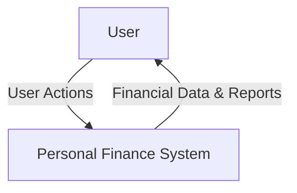

# Personal Finance Backend AWS - Data Flow Diagram (DFD)

## Level 0 - Context Diagram

## Level 1 - System Overview DFD

```mermaid
graph TD
    %% External Entities
    User[User]
    
    %% Main Processes
    AuthProcess[1.0 Authentication & Authorization]
    ExpenseProcess[2.0 Expense Management]
    PaymentProcess[3.0 Payment Account Management]
    ConfigProcess[4.0 Configuration Management]
    StatsProcess[5.0 Statistics & Reporting]
    ReceiptProcess[6.0 Receipt Management]
    
    %% Data Stores
    UserDB[(D1: User Database)]
    ExpenseDB[(D2: Expense Database)]
    PaymentDB[(D3: Payment Account Database)]
    ConfigDB[(D4: Config Type Database)]
    ReceiptStorage[(D5: Receipt Storage S3)]
    ConfigStorage[(D6: Config Data S3)]
    UIStorage[(D7: UI Assets S3)]
    AuthSecret[(D8: Auth Secrets)]
    
    %% User interactions
    User -->|Login/Signup/Logout| AuthProcess
    User -->|Manage Expenses| ExpenseProcess
    User -->|Manage Payment Accounts| PaymentProcess
    User -->|View Statistics| StatsProcess
    User -->|Upload/Download Receipts| ReceiptProcess
    
    %% Authentication flows
    AuthProcess -->|Store/Retrieve User Data| UserDB
    AuthProcess -->|Manage JWT Tokens| AuthSecret
    AuthProcess -->|Initialize User Config| ConfigProcess
    AuthProcess -->|Initialize Payment Accounts| PaymentProcess
    
    %% Expense management flows
    ExpenseProcess -->|Store/Retrieve Expenses| ExpenseDB
    ExpenseProcess -->|Validate Users| UserDB
    ExpenseProcess -->|Get Configuration| ConfigDB
    ExpenseProcess -->|Validate Payment Accounts| PaymentDB
    ExpenseProcess -->|Manage Receipt References| ReceiptStorage
    
    %% Payment account flows
    PaymentProcess -->|Store/Retrieve Accounts| PaymentDB
    PaymentProcess -->|Validate Users| UserDB
    PaymentProcess -->|Get Configuration| ConfigDB
    
    %% Configuration flows
    ConfigProcess -->|Store/Retrieve Config Types| ConfigDB
    ConfigProcess -->|Load Default Config| ConfigStorage
    
    %% Statistics flows
    StatsProcess -->|Aggregate Expense Data| ExpenseDB
    StatsProcess -->|Get User Info| UserDB
    StatsProcess -->|Get Configuration| ConfigDB
    StatsProcess -->|Get Payment Accounts| PaymentDB
    
    %% Receipt flows
    ReceiptProcess -->|Store/Retrieve Files| ReceiptStorage
    ReceiptProcess -->|Validate Expenses| ExpenseDB
    
    %% Return data flows
    AuthProcess -->|Auth Status & Tokens| User
    ExpenseProcess -->|Expense Data & Lists| User
    PaymentProcess -->|Account Information| User
    StatsProcess -->|Reports & Analytics| User
    ReceiptProcess -->|Receipt Files| User
```

## Level 2 - Detailed AWS Architecture DFD

```mermaid
graph TD
    %% External Entities
    User[User/UI Client]
    
    %% AWS Services
    CloudFront[CloudFront CDN]
    APIGateway[API Gateway]
    
    %% Lambda Functions
    AuthLambda[Auth Lambda]
    UserLambda[User Lambda]
    ExpenseLambda[Expense Lambda]
    PaymentLambda[Payment Lambda]
    ConfigLambda[Config Lambda]
    StatsLambda[Stats Lambda]
    ReceiptLambda[Receipt Lambda]
    AuthorizerLambda[Token Authorizer]
    SecretRotator[Secret Rotator]
    
    %% Storage
    UserDynamoDB[(User DynamoDB Table)]
    ExpenseDynamoDB[(Expense DynamoDB Table)]
    PaymentDynamoDB[(Payment Account DynamoDB)]
    ConfigDynamoDB[(Config Type DynamoDB)]
    ReceiptS3[(Receipt S3 Bucket)]
    ConfigS3[(Config Data S3)]
    UIS3[(UI Assets S3)]
    SecretsManager[(AWS Secrets Manager)]
    
    %% User requests flow
    User -->|HTTPS Requests| CloudFront
    CloudFront -->|Cache Miss/API Calls| APIGateway
    CloudFront -->|Cache Hit| User
    
    %% API Gateway routing
    APIGateway -->|/user/*| UserLambda
    APIGateway -->|/expenses/*| ExpenseLambda
    APIGateway -->|/payment/accounts/*| PaymentLambda
    APIGateway -->|/config/*| ConfigLambda
    APIGateway -->|/stats/*| StatsLambda
    APIGateway -->|/receipts/*| ReceiptLambda
    APIGateway -->|Authorization Check| AuthorizerLambda
    
    %% Authentication & Authorization flows
    UserLambda -->|Store/Retrieve User Data| UserDynamoDB
    UserLambda -->|Manage JWT Secrets| SecretsManager
    AuthorizerLambda -->|Validate Tokens| SecretsManager
    AuthorizerLambda -->|Check User Session| UserDynamoDB
    SecretRotator -->|Rotate JWT Secrets| SecretsManager
    
    %% User management flows
    UserLambda -->|Initialize Config Data| ConfigS3
    UserLambda -->|Create Config Types| ConfigDynamoDB
    UserLambda -->|Create Payment Accounts| PaymentDynamoDB
    
    %% Expense management flows
    ExpenseLambda -->|CRUD Operations| ExpenseDynamoDB
    ExpenseLambda -->|User Validation| UserDynamoDB
    ExpenseLambda -->|Configuration Lookup| ConfigDynamoDB
    ExpenseLambda -->|Payment Account Validation| PaymentDynamoDB
    
    %% Payment account flows
    PaymentLambda -->|CRUD Operations| PaymentDynamoDB
    PaymentLambda -->|User Validation| UserDynamoDB
    PaymentLambda -->|Configuration Lookup| ConfigDynamoDB
    
    %% Configuration flows
    ConfigLambda -->|CRUD Operations| ConfigDynamoDB
    ConfigLambda -->|User Validation| UserDynamoDB
    ConfigLambda -->|Load Defaults| ConfigS3
    
    %% Statistics flows
    StatsLambda -->|Query Expense Data| ExpenseDynamoDB
    StatsLambda -->|User Validation| UserDynamoDB
    StatsLambda -->|Configuration Data| ConfigDynamoDB
    StatsLambda -->|Payment Account Data| PaymentDynamoDB
    
    %% Receipt management flows
    ReceiptLambda -->|Upload/Download Files| ReceiptS3
    ReceiptLambda -->|Direct S3 Integration| APIGateway
    APIGateway -->|Direct S3 Operations| ReceiptS3
    
    %% UI Asset delivery
    CloudFront -->|Static Assets| UIS3
    
    %% Response flows back to user
    UserLambda -->|User Data & Auth Tokens| APIGateway
    ExpenseLambda -->|Expense Data| APIGateway
    PaymentLambda -->|Account Data| APIGateway
    ConfigLambda -->|Configuration Data| APIGateway
    StatsLambda -->|Statistics & Reports| APIGateway
    ReceiptLambda -->|Receipt Metadata| APIGateway
    APIGateway -->|JSON Responses| CloudFront
    CloudFront -->|HTTP Responses| User
```

## Data Flow Details

### 1. Authentication Flow
1. User submits login/signup credentials
2. API Gateway routes to User Lambda
3. User Lambda validates credentials against User DynamoDB
4. JWT token generated using secrets from AWS Secrets Manager
5. Token stored in User DynamoDB for session management
6. Token returned to user via Authorization header

### 2. Request Authorization Flow
1. User sends authenticated request with Bearer token
2. API Gateway invokes Token Authorizer Lambda
3. Authorizer validates JWT using Secrets Manager
4. Authorizer checks active session in User DynamoDB
5. If valid, generates IAM policy allowing access
6. Request proceeds to target Lambda function

### 3. Expense Management Flow
1. User requests expense operations (CRUD)
2. Expense Lambda validates user session
3. Reads/writes expense data from/to Expense DynamoDB
4. Validates configuration types from Config DynamoDB
5. Validates payment accounts from Payment DynamoDB
6. Returns processed data to user

### 4. Receipt Management Flow
1. User uploads receipt files
2. API Gateway directly integrates with S3 for file operations
3. Receipt Lambda manages metadata and associations
4. Files stored in Receipt S3 with lifecycle policies
5. Temporary uploads moved to permanent storage after expense creation

### 5. Statistics Flow
1. User requests statistical data
2. Stats Lambda aggregates data from multiple DynamoDB tables
3. Performs complex queries across Expense, User, Config, and Payment tables
4. Returns calculated statistics and reports

### 6. Configuration Flow
1. System loads default configurations from Config S3
2. User-specific config types stored in Config DynamoDB
3. Configuration data used across all other processes for validation

## Data Stores

### DynamoDB Tables
- **User Table**: User profiles, authentication data, session tokens
- **Expense Table**: Expense records with GSI for user-status queries
- **Payment Account Table**: User payment methods and accounts
- **Config Type Table**: Configuration types and metadata

### S3 Buckets
- **Receipt Storage**: User-uploaded receipt files with lifecycle management
- **Config Data**: Default system configuration templates
- **UI Assets**: Static website files served via CloudFront

### Secrets Manager
- **JWT Secrets**: Token signing keys with automatic rotation
- **Salt Values**: Password hashing salts

## Key Features
- **Serverless Architecture**: All compute via AWS Lambda
- **JWT Authentication**: Stateless token-based authentication
- **Direct S3 Integration**: API Gateway directly handles file uploads/downloads
- **Data Validation**: Cross-table validation for data integrity
- **Caching**: CloudFront CDN for static assets and API responses
- **Lifecycle Management**: Automated S3 object lifecycle for cost optimization
- **Secret Rotation**: Automated JWT secret rotation for security
